## 基于Java+Springboot+vue的图书管理系统044

## 一、系统介绍
本项目前后端分离

本项目分为管理员与普通用户两种角色

体实现功能如下: 用户系统权限控制管理:主要实现用户、管理员、用户，为不同身份用户提供不同业务功能，疏导业务流向； 

- 图书管理模块:
主要实现图书信息存储与发布、借阅与归还、在线使用图书信息、图书采购、出入库、审批 等操作，
- 仓储管理模块:
书架信息管理、书架层信息管理、库位信息
- 用户管理模块:
用户管理、角色管理、部门管理、岗位管理
- 常用功能模块:
图书搜索、图书借阅、图书归还、归还记录；
- 其他信息管理:
图书机构管理、作者列表管理、出版社管理
- 系统监控管理:
在线用户、定时任务、数据监控、服务监控、缓存监控
- 资源统计:
- 系统工具
表单构建、代码生成、系统接口

用户：
图书搜索、图书借阅、图书归还、归还记录；

## 二、所用技术

后端技术栈：

- springboot
- mybatis-plus
- druid
- mysql
- spring-security
- redis
- jwt
- 等等

前端技术栈：

- vue全家桶
- elment-ui
- echarts
- axios
- 等等

## 三、环境介绍

基础环境 :IDEA/eclipse, JDK 1.8, Mysql5.7,Node.js,Maven

源码+数据库脚本

所有项目以及源代码本人均调试运行无问题 可支持远程调试运行

## 四、页面截图

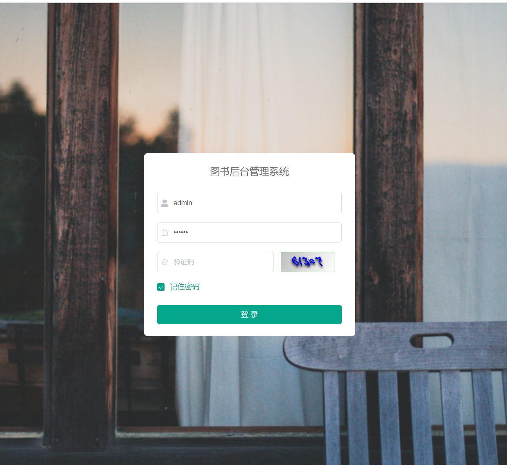

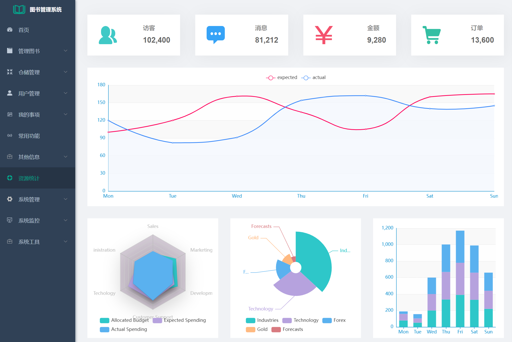

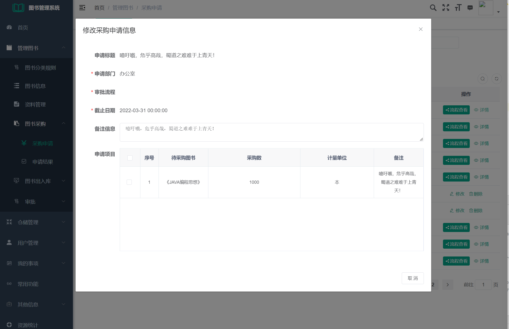

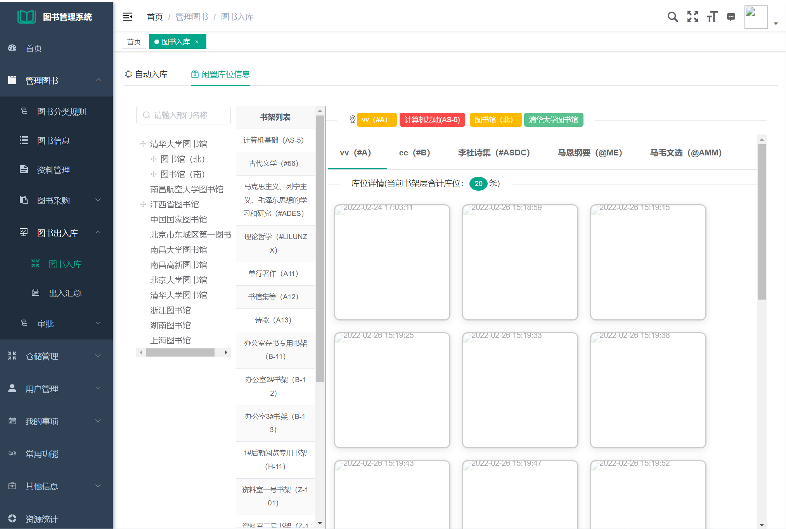

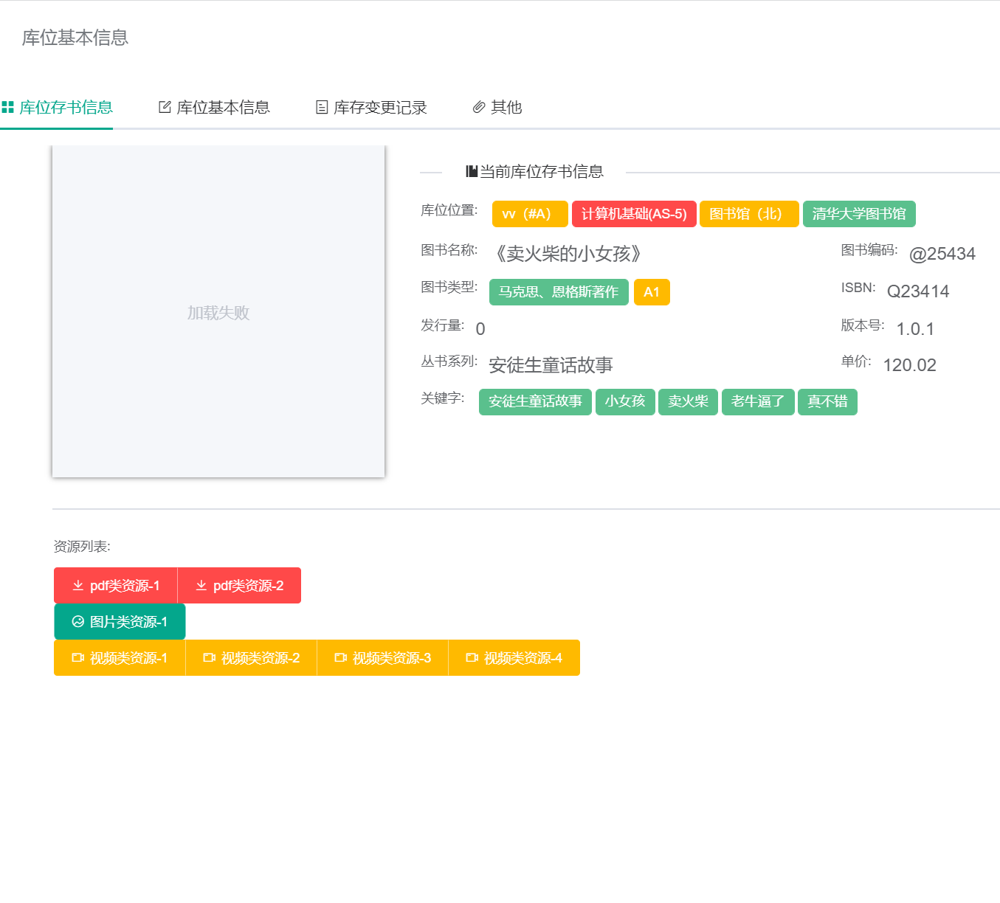

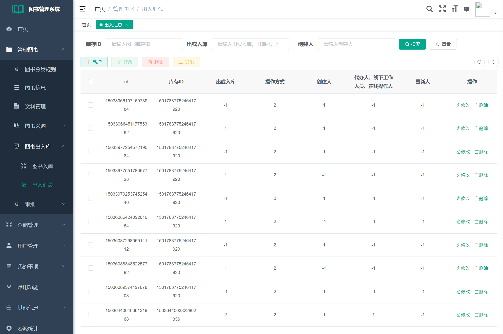

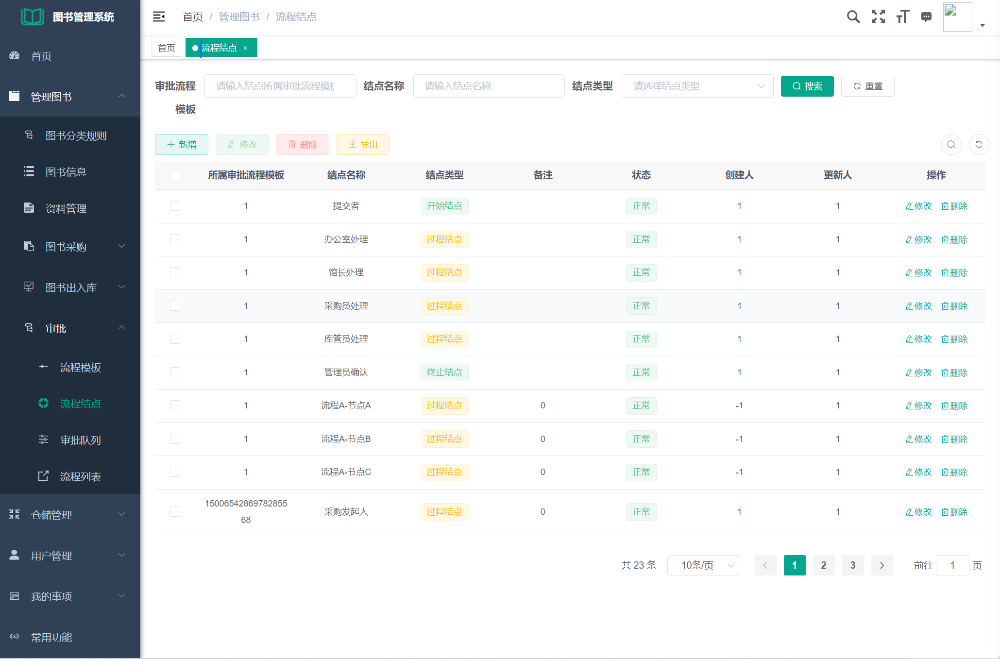

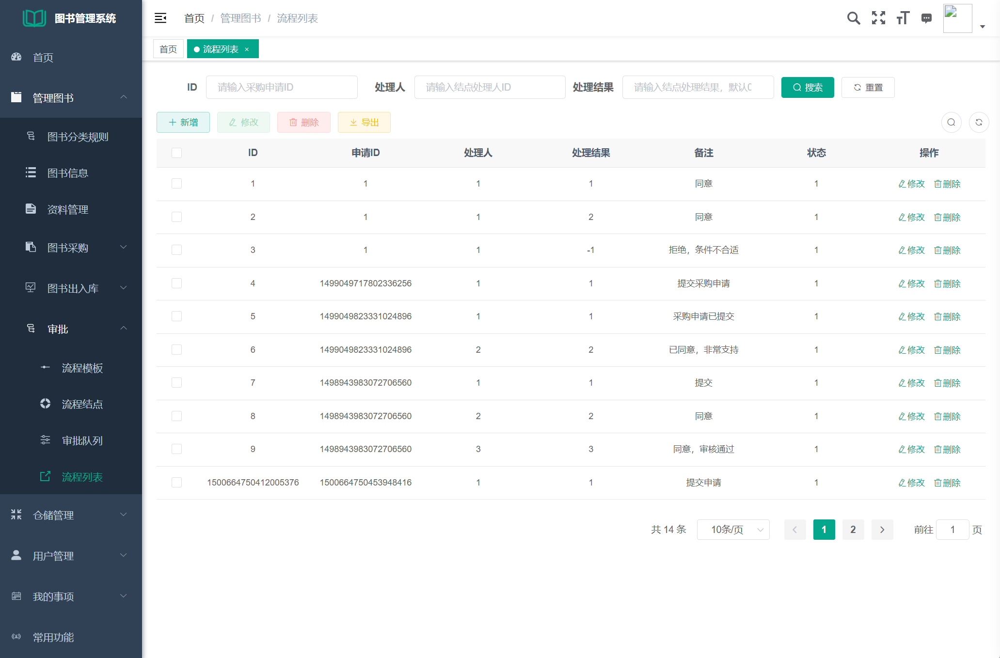

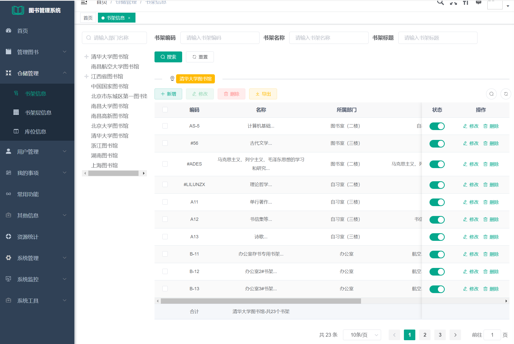

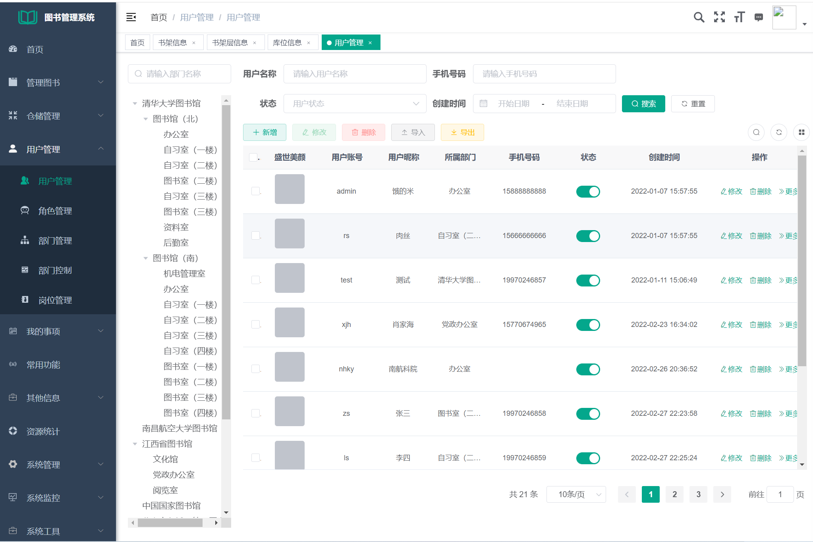

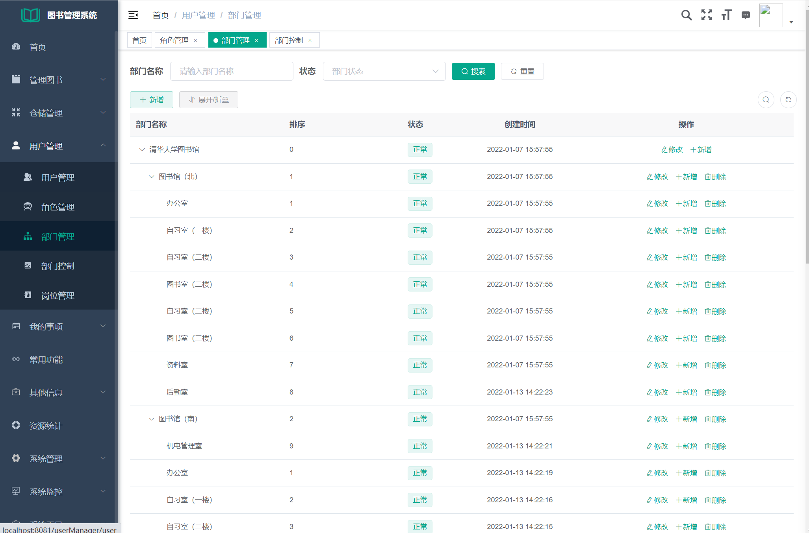

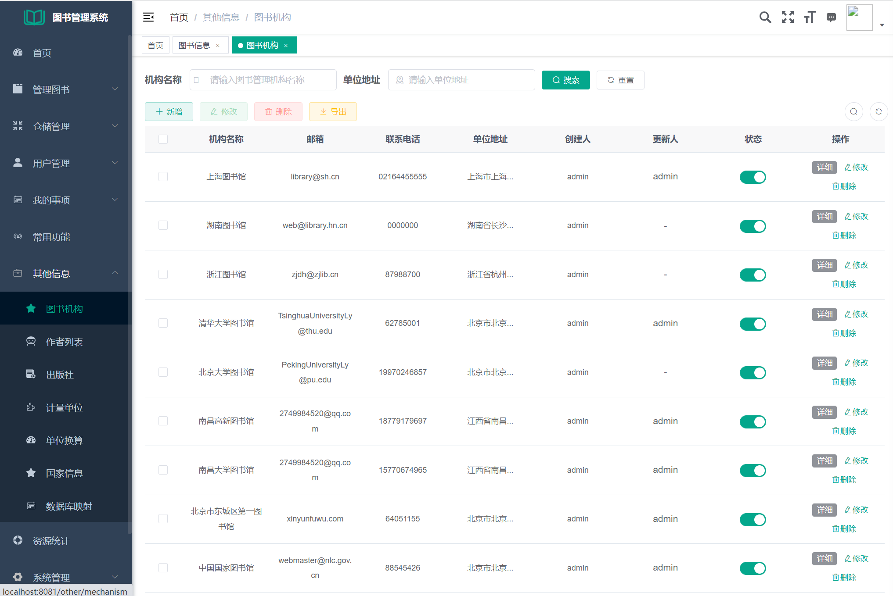

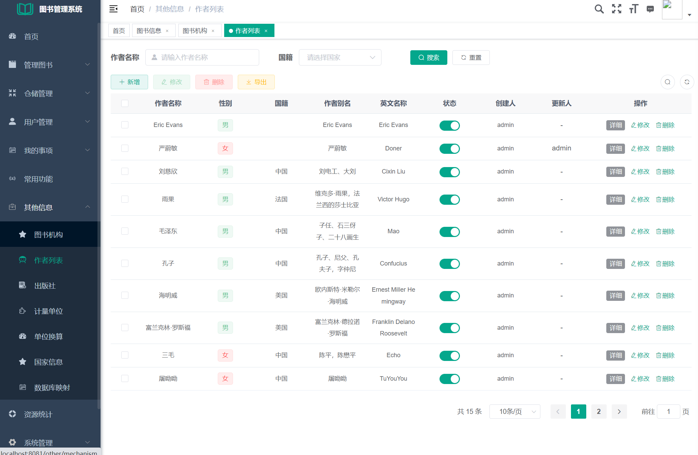

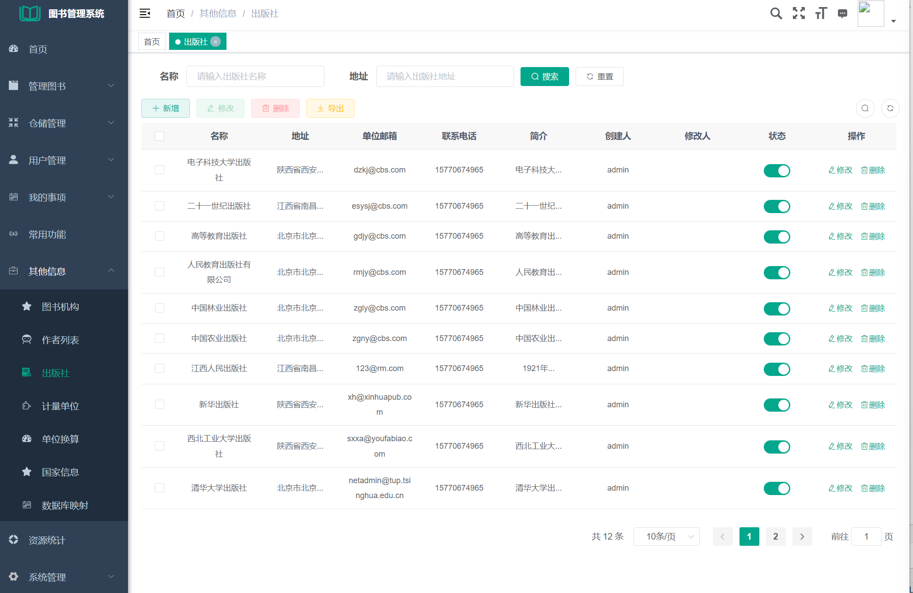

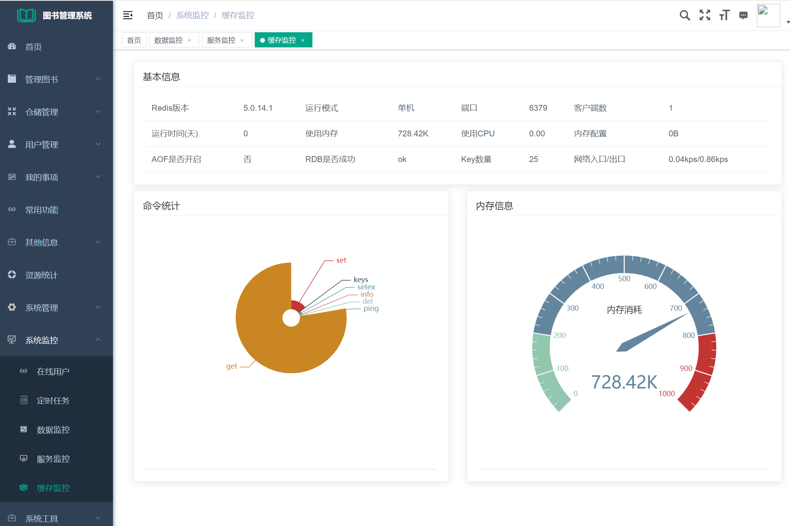

## 五、浏览地址

前端访问地址：http://localhost:8081/

图书管理员账号/密码：hick/123456

超级管理员账号/密码：admin/123456

用户账号/密码：test/123456

## 六、安装教程

1. 使用Navicat或者其它工具，在mysql中创建对应名称的数据库，并导入项目的sql文件；
2. 使用IDEA/Eclipse/MyEclipse导入项目，Eclipse/MyEclipse导入时，若为maven项目请选择maven;
   若为maven项目，导入成功后请执行maven clean;maven install命令，然后运行；
3. 修改application.yml 里面的数据库配置和redis配置
4. 启动nhXJH-admin项目后端项目 
5. vscode打开viewSM项目，
6. 打开终端，执行npm install 依赖下载完成后执行 npm run dev,执行成功后会显示访问地址
7. 访问  http://localhost:8081/

